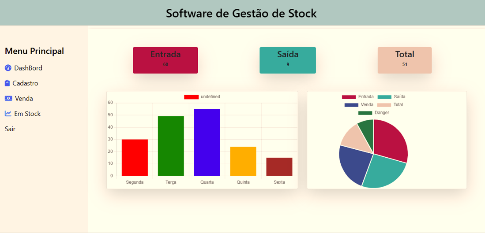
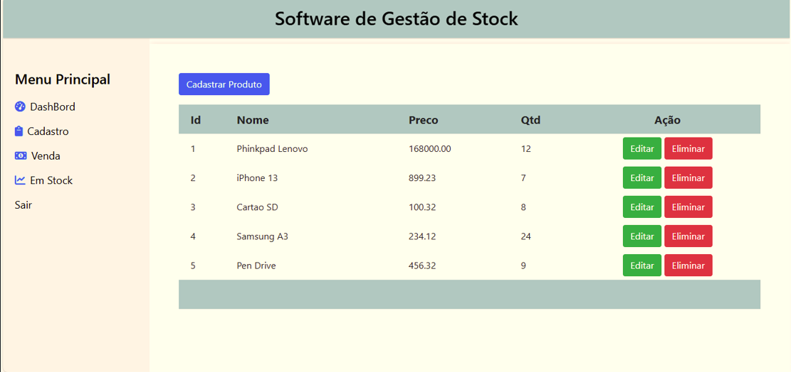
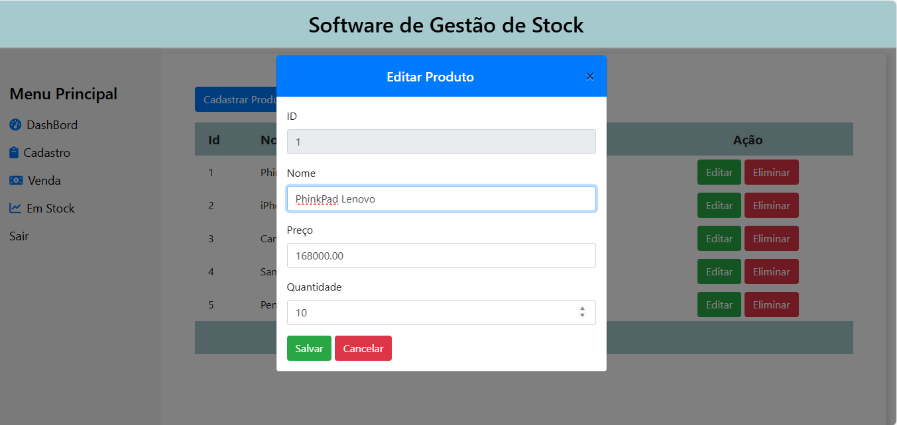
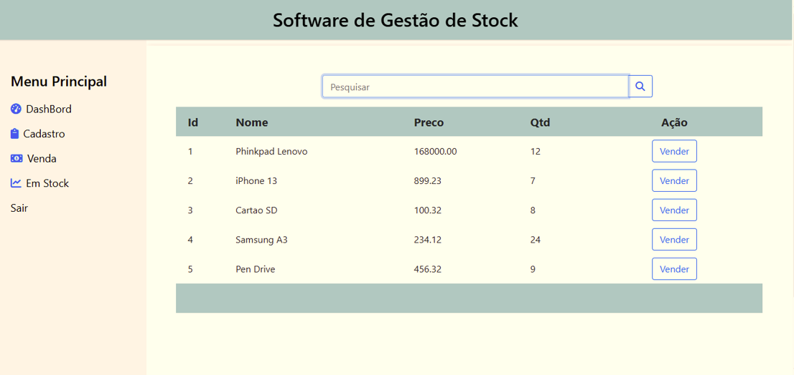
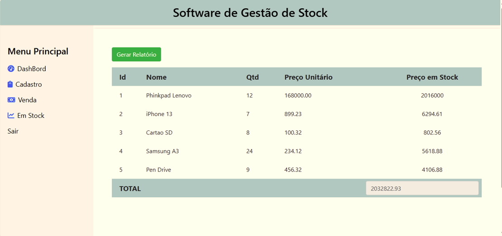
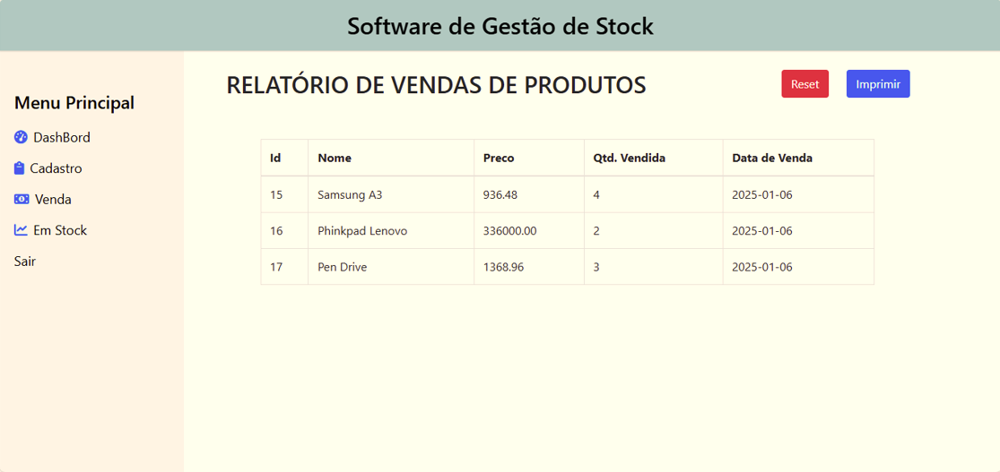

<h1 align="center">
     Gestão de Stock 
</h1>
 <h2 align="center">
     Sistema de Gestão de Stock (entrada e saída de produto) 
</h2>

 ## Este sistema consiste em:
 - Cadastrar Produtos
 - Vender Produtos
 - Mostrar Produtos total em Stock
 - Quantidades de Entrada
 - Quantidade de saida
 - Imprimir o Relatorio

### Dashboard

### Tela de Cadastro

### Cadastro de Produto

### Editar Produto

### Tela de Venda

### Venda de Produto

### Produtos em Stock

### Relatorio

